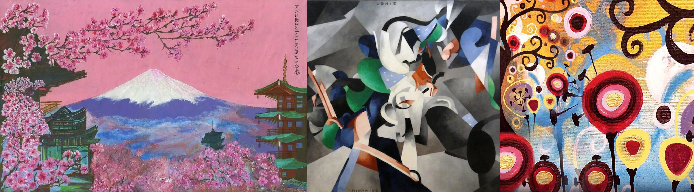
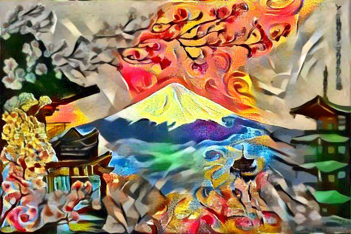

# dls_nst_hw

Перенос 2 стилей на разные части картинки базовым Neural Style Transfer.
Чтобы не было скучно, маска создаётся из диаграммы Вороного, которая строится по рандомно инициализируемым точкам

Исходные картинки:

Результат:

За основу реализации взят материал из этого бложека https://nextjournal.com/gkoehler/pytorch-neural-style-transfer
